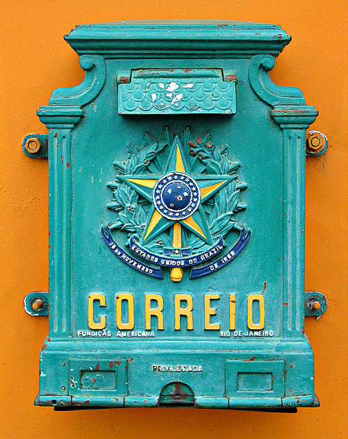
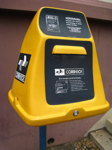
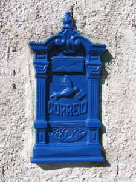
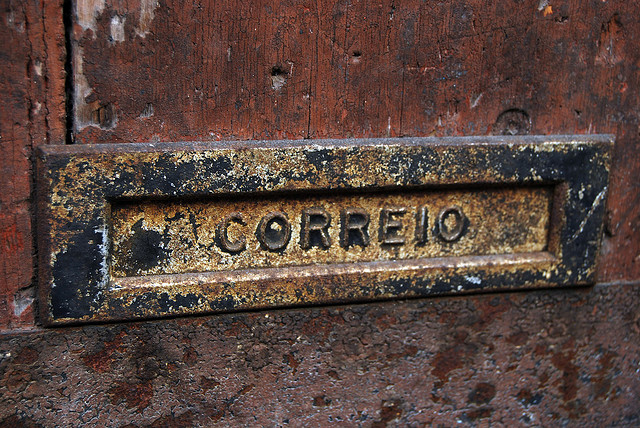
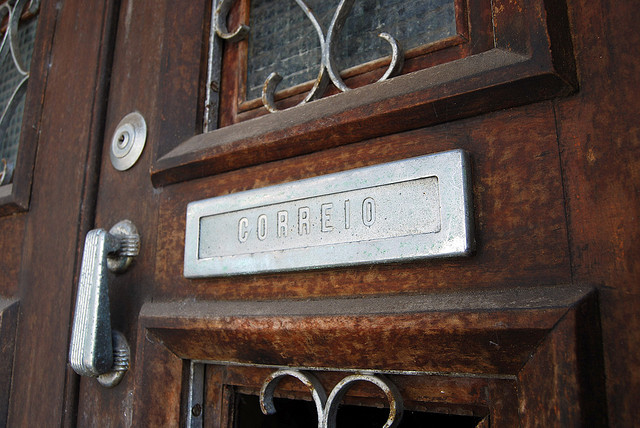

\[caption id="attachment\_216" align="aligncenter" width="508"\] Foto: Ricardo Mendonça Ferreira/Flickr\[/caption\]

**Por Daniel Santini, Vitor George e Miguel Peixe**

Você sabia que a base de dados com todos os Códigos de Endereçamento Postal (CEP) brasileiros é tratada como informação privada e comercializada pela Empresa de Correios e Telegrafos (ECT)? Que já foram feitas pelo menos três solicitações com base na [Lei de Acesso à Informação](https://www.codigourbano.org/como-usar-a-lei-de-acesso-a-informacao/), mas que a empresa se recusou à fornecer o acesso público à base completa? Que os Correios chegaram a entrar com pedidos de registro no Brasil e até na Alemanha para tentar patentear os códigos postais brasileiros?

Para entender melhor a questão, primeiro é preciso entender como funciona o sistema. Hoje os Correios disponibilizam o acesso à base, mas de maneira limitadíssima, com um [sistema de consulta bastante simples](http://www.buscacep.correios.com.br/) em que só é possível fazer uma busca por vez. Na página, além de um sisudo "_© Copyright 2014 Correios - Todos os direitos reservados_" (no rodapé), vem um aviso direto:

_"O uso deste aplicativo é restrito a consultas individuais de CEP, destinadas a endereçamentos de objetos de correspondências a serem postadas nos Correios. Para outras finalidades consulte o Diretório Nacional de Endereços - DNE"._

A limitação faz com que, quem trabalha com uma relação de CEPs ou endereços, tenha que comprar o tal [Diretório Nacional de Endereços](http://www.correios.com.br/para-voce/correios-de-a-a-z/dne#tab-2), em pacotes que podem custar até [R$ 2.500,00](http://www.correios.com.br/para-voce/correios-de-a-a-z/dne#tab-2)! Isso limita ou até inviabiliza o acesso para microempreendedores e para quem trabalha em projetos de orçamento limitado e ou sem fins lucrativos.

\[caption id="attachment\_219" align="alignright" width="225"\] Foto: Francisco Martins/Flickr\[/caption\]

**Tentativas de abrir a base** Entre as solicitações de informações envolvendo a ECT disponíveis na página [AcessoaInformação.gov.br](http://www.acessoainformacao.gov.br/precedentes/ECT/), há pelo menos três pedidos diretos de acesso à base de dados de códigos postais brasileiros em que os autores recorreram em primeira e segunda instância e receberam pareceres favoráveis da Controladoria-Geral da União. Por diferentes motivos, porém, os três acabaram negados (veja os pedidos na íntegra: [99923.001172/2012-06](http://www.acessoainformacao.gov.br/precedentes/ECT/99923001172201206.pdf), [99923.000436/2013-87](http://www.acessoainformacao.gov.br/precedentes/ECT/99923000436201387.pdf) e [99923.000706/2013-50](http://www.acessoainformacao.gov.br/precedentes/ECT/99923000706201350.pdf)).

O [primeiro](http://www.acessoainformacao.gov.br/precedentes/ECT/99923001172201206.pdf), de 2012, tem como base o seguinte argumento em favor da abertura dos dados:

_"Muitos sistemas necessitam acesso à base de dados do CEP, porém a ECT coloca barreiras técnicas e financeiras ao acesso a estes dados. A falta de acesso livre a esta base de dados causa a disseminação de cópias desatualizadas, o que prejudica não apenas os usuários mas a própria ECT, uma vez que ela é obrigada a entregar correspondência mesmo com o CEP informado incorretamente. Portanto é do interesse do público e da própria ECT que estes dados sejam oferecidos de forma livre através de uma API (interface de programação) aberta e de fácil utilização."_

Em resposta, os Correios alegaram que o Diretório Nacional de Endereços é uma "obra intelectual" e que protocolaram no "Instituto Nacional de Propriedade Industrial (INPI) o pedido de Patente de Invenção, sob o Nº PI 0.204.305-0", além de terem solicitado "extensão da patente de invenção, indicada no subitem 1.1.3, perante o German Patent Applicatations, sob nº 10.346.551.0." No site do INPI, consta que quem solicitou a patente no INPI foi o engenheiro Odarci Roque de Maia Jr., um dos responsáveis pelo DNE.

**Dá para patentear o cadastro de CEPs?**  A ideia de patentear o cadastro público de códigos postais foi considerada sem sentido pela Controladoria-Geral da União, conforme destacado no parecer:

\[caption id="attachment\_221" align="alignleft" width="225"\] Foto: Sottovia / Flickr\[/caption\]

_Segundo a [Lei 9.279/1996](http://www.planalto.gov.br/ccivil_03/leis/l9279.htm), em seu art. 8º, é patenteável a invenção que atenda aos requisitos de novidade, atividade inventiva e aplicação industrial. Ora, se é evidente que o objeto da solicitação conta com o requisito de aplicação industrial, o mesmo certamente não se poderá dizer a respeito do requisito de novidade. Segundo o art. 11 daquela lei, será nova a invenção que não esteja compreendida no estado da técnica, o qual é constituído “por tudo aquilo tornado acessível ao público antes da data de depósito do pedido de patente, por descrição escrita ou oral, por uso ou qualquer outro meio, no Brasil ou no exterior”. Ninguém haverá de refutar a tese de que o CEP, seja ele individualizado ou como lista completa, já deixou de estar em estado da técnica muito tempo antes da data do referido depósito, em 2002. (...) A Lei de Patentes é clara em seu art. 10º, ainda, ao informar que não se considera invenção e, portanto, não patenteável como tal: V - programas de computador em si; VI - apresentação de informações;  (...) Por fim, parece-nos claro que o conteúdo de banco de dados não é objeto patenteável e, caso tal ocorra, poderá vir ser objeto de declaração de nulidade, por força do art. 46 da Lei 9.279/1996._

O parecer defende ainda que a ideia de vender a base de dados afronta o artigo 12 da [Lei 12.527/2011  (Lei de Acesso à Informação](http://www.planalto.gov.br/ccivil_03/_ato2011-2014/2011/lei/l12527.htm) ("_O serviço de busca e fornecimento da informação é gratuito, salvo nas hipóteses de reprodução de documentos pelo órgão ou entidade pública consultada, situação em que poderá ser cobrado exclusivamente o valor necessário ao ressarcimento do custo dos serviços e dos materiais utilizados_") e lembra que, desde sua criação, em 1971, o CEP sempre foi tratado como informação pública. Diz o parecer:

_"Em momento algum, ao longo destes mais de quarenta anos, fez uso a ECT da prerrogativa do [art. 15 da Lei Postal](http://www.planalto.gov.br/ccivil_03/leis/L6538.htm) para impedir que as prefeituras divulgassem, por meio de sinalização, todos os Códigos de Endereçamento dos municípios. Presume-se, de tal comportamento, que havia então um consenso de que a informação revestia-se de interesse público e, portanto, deveria ser divulgada._

**Transparência ativa** O texto ressalta ainda o caráter público da informação ao apontar que, apesar de restringir a difusão do catálogo de CEPs para fins comerciais, o [artigo 15](http://www.planalto.gov.br/ccivil_03/leis/L6538.htm) citado já previa a possibilidade de distribuição gratuita dos dados: "_§ 3º - É facultada a edição de lista de endereçamento postal sem finalidade comercial e de distribuição gratuita, conforme disposto em regulamento_". O parecer destaca ainda que a divulgação dos CEPs é fundamental para que a União consiga manter o serviço postal em funcionamento, o que está previsto na Constituição.

\[caption id="attachment\_222" align="aligncenter" width="640"\] Foto: Zyberchema / Flickr\[/caption\]

O parecer dá razão ao solicitante, mas aponta que, por se tratar de uma demanda de interesse público e coletiva, "foge aos procedimentos e prazos previstos para as demandas por transparência passiva", o que impede que o recurso seja acolhido. A CGU, porém, conclui recomendando à empresa "medidas adequadas para, em tempo futuro, disponibilizar a informação solicitada em transparência ativa, conforme determina o art. 8º da [Lei 12.527/2011](http://www.planalto.gov.br/ccivil_03/_ato2011-2014/2011/lei/l12527.htm)".

No [segundo](http://www.acessoainformacao.gov.br/precedentes/ECT/pa30122013.pdf) e no [terceiro](http://www.acessoainformacao.gov.br/precedentes/ECT/pa532014.pdf) pedidos feitos a partir da Lei de Acesso à Informação, além dos argumentos iniciais os Correios ainda apresentaram novas alegações, incluindo a de risco "à competitividade ou governança corporativa", informando que a "receita da venda de licenças do e-DNE no exercício de 2012 haveria atingido o valor de 1,4 milhão de reais, e que em maio do ano corrente \[2013\] o valor já alcançara o montante de R$ 667.620,00". Contra este argumento a CGU apontou que o valor citado é "irrisório" "diante de um faturamento anual superior a R$ 14 bilhões, segundo dados de 2011 existentes no sítio da empresa". Em 2013, segundo as [informações mais atualizadas do site do Correios](http://www.correios.com.br/sobre-correios/a-empresa/quem-somos/principais-numeros), o faturamento foi de R$ 16,66 bilhões. Não há dados sobre quanto foi obtido com a venda do cadastro.

O novo parecer destaca que:

_"Como se percebe, longe está a ECT de adequar a disponibilização de informações relativas a códigos de endereçamento em conformidade com as obrigações de transparência ativa previstas na Lei de Acesso à Informação"._ 

**Direito autoral?!** Apesar de reconhecer que o CEP é informação pública, os pareceres apontam que, por ter sido organizado por uma empresa pública, "uma pessoa jurídica de direito privado", tal base estaria sujeita a lei de direitos autorais. Por entender haver a necessidade de regulamentação para definir "o caráter público da informação solicitada ou, de forma diversa, seu caráter patrimonial", a CGU encaminhou o caso para a [Comissão Mista de Reavaliação de Informações](http://denuncia.cgu.gov.br/acessoainformacaogov/comissao-mista/index.asp) (CMRI). Esta comissão interministerial, que é presidida pela Casa Civil da Presidência da República, devolveu a bola defendendo que o mesmo fosse analisado a partir da [Lei Postal](http://www.planalto.gov.br/ccivil_03/leis/L6538.htm), sem mais explicações.

\[caption id="attachment\_223" align="aligncenter" width="640"\] Foto: Chav Gecko / Flickr\[/caption\]

Na conclusão dos pareceres, o relator conclui defendendo que a CMRI determinou que a Lei Postal prevalece sobre a Lei de Acesso à Informações, "de onde se admite que, em tese, possa uma informação pública ser objeto de comercialização, e que a sua natureza patrimonial decorra da possibilidade de comercialização, e não de pré- existente direito de propriedade que sobre ela haja recaído, subtraindo-a da esfera pública".

E lembra que quem fez o pedido pode recorrer à CMRI, pedindo que a decisão seja revista. Na página de [decisões](http://www.acessoainformacao.gov.br/assuntos/recursos/recursos-julgados-a-cmri/decisoes) de recursos apresentados à CMRI ainda não há nenhum referente ao tema.

* * *

**Outro lado** O Código Urbano procurou a assessoria de imprensa dos Correios para abrir espaço para um posicionamento sobre o tema. Os representantes da empresa destacaram a conclusão dos pareceres (pelo desprovimento dos pedidos com base na LAI) e lembraram que a informação já está disponível para consultas individualizadas, sem mencionar a recomendação para que o sistema fosse aberto integralmente e passasse a permitir consultas gerais.

Questionados se existe interesse em melhorar o acesso, ainda que apenas para fins não comerciais, e se existe perspectiva para a base integral ser aberta, os assessores dos Correios responderam que "em conformidade com a Lei 6.538/78 que regula os direitos e obrigações concernentes ao Serviço Postal, notadamente pela por força do artigo 8º, inc. II, a ECT  pode comercializar a sua base de dados do CEP" e que "para atender as necessidades de acesso e obtenção da base de dados do CEP, os Correios ofertam ao mercado os produtos Guia Postal Brasileiro (GPB) e o Diretório Nacional de Endereços (DNE), nas modalidades Básico e Master, que podem ser adquiridos na loja virtual [http://www.shopping.correios.com.br/](http://www.shopping.correios.com.br/)."

**[Leia a resposta dos Correios na íntegra.](http://wp.me/p5HYhU-3q)**

Mesmo com o posicionamento, seguimos confusos com a ideia de que uma base pública, cuja divulgação é de interesse público, possa permanecer fechada sendo acessível apenas para quem tem dinheiro. E insistimos para nossos amigos dos Correios abrirem a base de dadospara todos.

#LiberteoCEP

\[caption id="attachment\_224" align="aligncenter" width="640"\] Foto: Zyberchema / Flickr\[/caption\]
