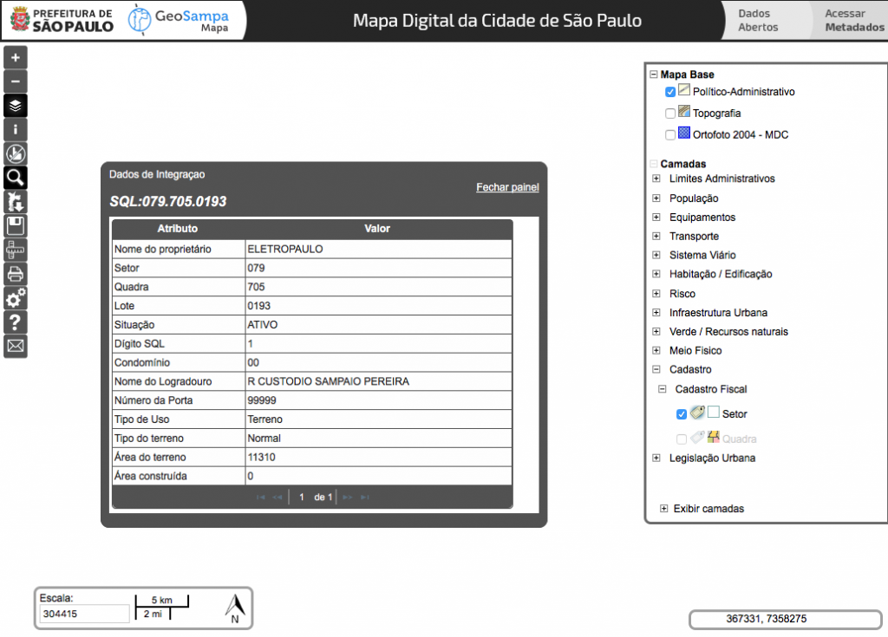

Na tarde desta quinta-feira (25/02) está prevista a segunda votação da nova Lei de Zoneamento da cidade de São Paulo, o [Projeto de Lei (PL) 272/2015.](http://www.camara.sp.gov.br/blog/minuta-do-relatorio-da-comissao-de-politica-urbana-metropolitana-e-meio-ambiente-ao-pl-27215-em-conformidade-com-os-vereadores-tecnicos-e-a-sociedade/) Entre os temas em discussão que devem ser decididos nesta tarde, está a proposta de se permitir a construção de equipamentos públicos em áreas verdes públicas, incluindo parques. A Prefeitura de São Paulo, que apresentou o projeto, [argumenta](http://gestaourbana.prefeitura.sp.gov.br/noticias/proposta-de-zoneamento-pode-permitir-instalacao-de-equipamentos-publicos-em-areas-perifericas/) que esta seria uma forma de abrir espaço para a construção de creches e postos de saúde em áreas periféricas. Pela proposta, a instalação de equipamentos públicos seria em no máximo 40% da área dos terrenos e estaria condicionada à comprovação da necessidade nas regiões específicas, e seria acompanhada de: implantação de área verde pública com metragem equivalente no mesmo distrito ou subprefeitura; ou o que a Prefeitura chama de "qualificação ambiental de área pública municipal já existente", com aumento da permeabilidade; ou destinação de contrapartida financeira ao Fundo Municipal de Parques.

A proposta de se permitir construções em áreas verdes públicas provocou críticas de ambientalistas e [vereadores de oposição](http://www.nossasaopaulo.org.br/noticias/lei-de-zoneamento-vereadores-criticam-permissao-de-equipamentos-publicos-em-areas-verdes), que consideram que áreas de mananciais e preservação ambiental podem acabar comprometidas pelo projeto. A possibilidade de se compensar construções com recursos financeiros é especialmente preocupante, já que, na prática, significa uma redução das áreas verdes - mesmo considerando que o dinheiro seria revertido para o Fundo Municipal de Parques. O tema é especialmente sensível em um cenário em que a impermeabilidade excessiva do solo decorrente da cobertura de asfalto e cimento fragiliza as bacias hidrográficas, levando a escassez de água e, ao mesmo tempo, alamentos na cidade. A Prefeitura [alega](http://gestaourbana.prefeitura.sp.gov.br/noticias/proposta-de-zoneamento-pode-permitir-instalacao-de-equipamentos-publicos-em-areas-perifericas/) que "as áreas de preservação ambiental serão rigorosamente conservadas, e não há previsão de qualquer flexibilização da legislação ambiental".

Com o intuito de contribuir com a discussão o Código Urbano mapeou terrenos ainda não ocupados na cidade, muitos dos quais em áreas periféricas. O levantamento foi feito a partir de informações do [Geosampa](http://geosampa.prefeitura.sp.gov.br/PaginasPublicas/_SBC.aspx#), o sistema de informações georeferenciadas da Prefeitura de São Paulo, que trabalha com informações da base do IPTU da cidade. A partir da raspagem automática desses dados feitas por um robô, foi possível identificar a existência de pelo menos 4 milhões de metros quadrados de terrenos livres que poderiam ser utilizados para construção, sem contar edificações sem uso.

O mapa abaixo mostra terrenos com mais de 10 mil metros quadrados na cidade, de acordo com a base da Prefeitura. Clique nos terrenos para ver detalhes:

<iframe src="https://tiagofassoni.cartodb.com/viz/59eaf59c-db98-11e5-893e-0e787de82d45/embed_map" allowfullscreen="allowfullscreen" width="100%" height="520" frameborder="0"></iframe>

**Terrenos privados**  
As informações indicam que há muitos terrenos vazios subaproveitados em áreas carentes de equipamentos públicos. O problema é que, para que eles sejam ocupados por escolas, creches, postos de saúde e estruturas similares, teriam que ser desapropriados, já que a maioria encontra-se nas mãos de grupos privados. Agrupando os dados por proprietários, observamos a participação de incorporadoras, empresas e também pessoas físicas, incluindo aí:

- Eletropaulo: 468 mil m2;
- Flora Desenvolvimento Imobiliário Ltda: 136 mil m2;
- Gazal Zarzur: 98 mil m2;
- Esso: 97 mil m2;
- MRV Engenharia: 85 mil m2
- George Luiz Esteve: 85 mil m2;
- Indústrias Matarazzo: 80 mil m2;
- Brookfield, com 73 mil m2
- Manfred Reimar Von Schaaffhausen: 50 mil m2;
- Raphael Jafet Junior: 52 mil m2;
- Gafisa: 40 mil m2;

Uma prévia de dados de imóveis com área acima de 10.000 metros quadrados identificados neste levantamento inicial encontra-se disponível para baixar [aqui](https://github.com/tiagofassoni/terrenos_grandes_sao_paulo). Além de mapear espaços que poderiam ser ocupados, o trabalho também permitiu identificar falhas no cadastro de IPTU da cidade. O georeferenciamento das informações permite visualizar que há imóveis que, apesar de estarem cadastrados como terrenos livres, estão ocupados por edificações.

**Baixe os dados  
**É possível verificar cada ponto identificado no mapa diretamente no [sistema GeoSampa](http://geosampa.prefeitura.sp.gov.br/PaginasPublicas/_SBC.aspx), no site da Prefeitura de São Paulo. Disponibilizamos, além da visualização, um repositório com os dados brutos ([aqui](https://github.com/tiagofassoni/terrenos_grandes_sao_paulo/blob/master/iptu_mais_de_10_mil_metros_quadrados.geojson)), onde é possível pesquisar qual o setor, quadra e lote de cada terreno. Com essas informações, dá para confirmar cada dado diretamente no site do Geosampa - é só clicar na lupa do lado esquerdo, selecionar a aba de IPTU e digitar os valores.

O resultado é apresentado no seguinte formato:

<figure>

<figcaption>

Exemplo de busca de IPTU no Geosampa

</figcaption>

</figure>

A ONG Minha Sampa, uma das organizações críticas a essa mudança prevista no projeto de lei, promoveu um [abaixo-assinado](http://paneladepressao.nossascidades.org/campaigns/899?success=true) para pressionar a Câmara. Também é possível consultar e questionar diretamente [os vereadores](http://www.camara.sp.gov.br/vereadores/) sobre o projeto e, neste domingo, dia 28, participar de uma [aula pública sobre Direito à Cidade](http://polis.org.br/noticias/aula-publica-na-paulista-conversas-de-rua-o-direito-a-cidade/) que o Instituto Pólis realiza na Avenida Paulista.

_\* Texto atualizado na manhã desta quinta-feira, dia 25, com inclusão de links e mais informações sobre o projeto em discussão._
